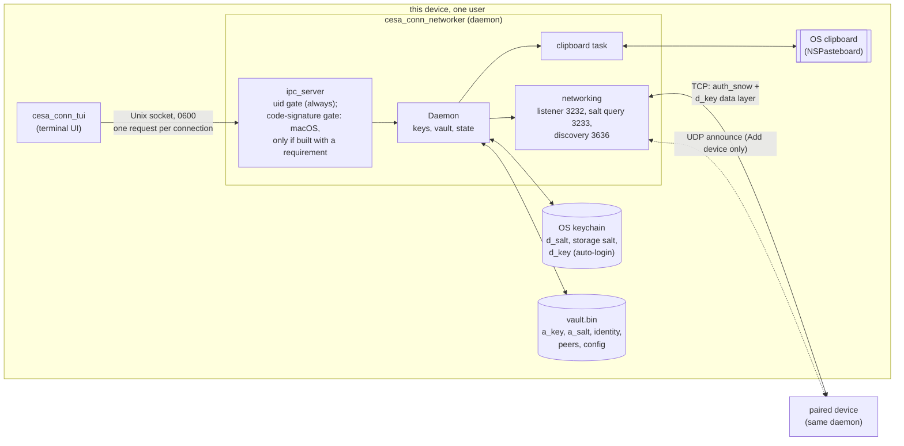
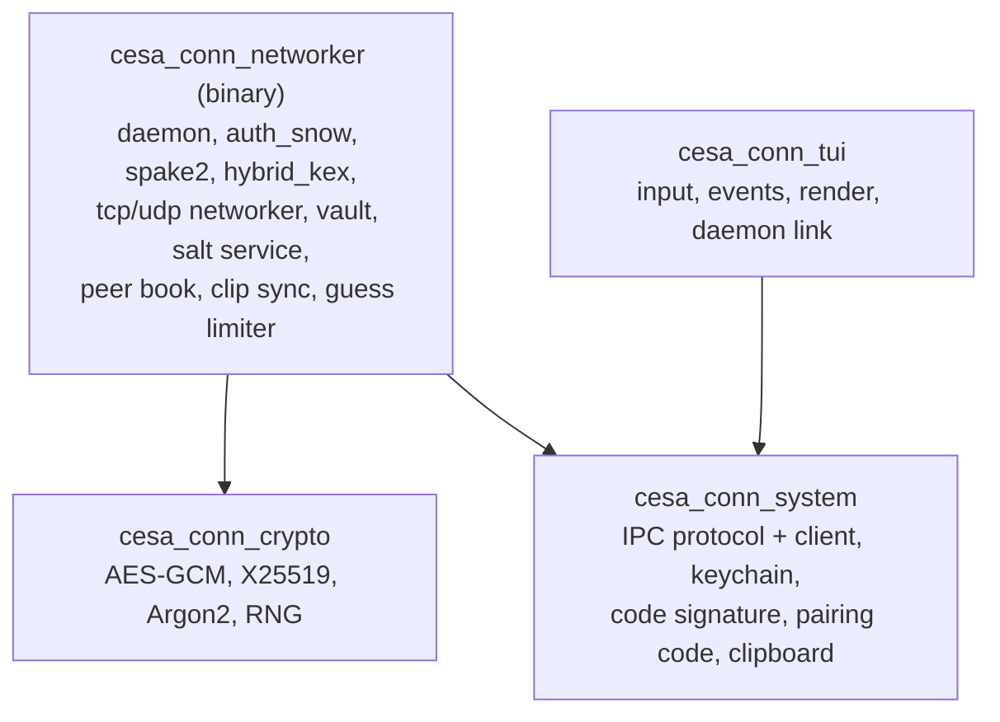
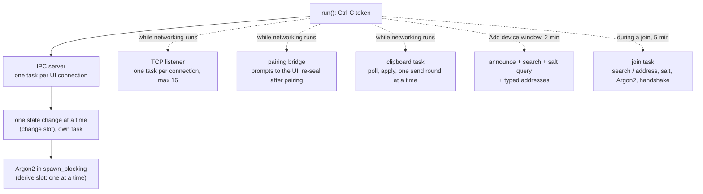

# Architecture

daemon.md sections 1 and 5. The daemon owns every secret; the UI only sends
passwords once and shows status.

```mermaid
flowchart LR
    subgraph user["this device, one user"]
        tui["cesa_conn_tui<br/>(terminal UI)"]
        subgraph daemon["cesa_conn_networker (daemon)"]
            ipc["ipc_server<br/>uid gate (always);<br/>code-signature gate: macOS,<br/>only if built with a requirement"]
            core["Daemon<br/>keys, vault, state"]
            net["networking<br/>listener 3232, salt query 3233,<br/>discovery 3636"]
            clip["clipboard task"]
        end
        os_kc[("OS keychain<br/>d_salt, storage salt,<br/>d_key (auto-login)")]
        vault[("vault.bin<br/>a_key, a_salt, identity,<br/>peers, config")]
        pb[["OS clipboard<br/>(NSPasteboard)"]]
    end
    peer["paired device<br/>(same daemon)"]

    tui -- "Unix socket, 0600<br/>one request per connection" --> ipc
    ipc --> core
    core --> net
    core --> clip
    core <--> os_kc
    core <--> vault
    clip <--> pb
    net <-- "TCP: auth_snow +<br/>d_key data layer" --> peer
    net <-. "UDP announce (Add device only)" .-> peer
```

## Crates

```mermaid
flowchart TB
    crypto["cesa_conn_crypto<br/>AES-GCM, X25519, Argon2, RNG"]
    system["cesa_conn_system<br/>IPC protocol + client, keychain,<br/>code signature, pairing code, clipboard"]
    networker["cesa_conn_networker (binary)<br/>daemon, auth_snow, spake2, hybrid_kex,<br/>tcp/udp networker, vault, salt service,<br/>peer book, clip sync, guess limiter"]
    tui["cesa_conn_tui<br/>input, events, render, daemon link"]

    networker --> crypto
    networker --> system
    tui --> system
```

## Inside the daemon (tasks)

```mermaid
flowchart TB
    main["run(): Ctrl-C token"] --> ipcs["IPC server<br/>one task per UI connection"]
    ipcs --> change["one state change at a time<br/>(change slot), own task"]
    change --> argon["Argon2 in spawn_blocking<br/>(derive slot: one at a time)"]
    main -. "while networking runs" .-> listener["TCP listener<br/>one task per connection, max 16"]
    main -. "while networking runs" .-> bridge["pairing bridge<br/>prompts to the UI, re-seal after pairing"]
    main -. "while networking runs" .-> cliptask["clipboard task<br/>poll, apply, one send round at a time"]
    main -. "Add device window, 2 min" .-> window["announce + search + salt query<br/>+ typed addresses"]
    main -. "during a join, 5 min" .-> join["join task<br/>search / address, salt, Argon2, handshake"]
```
