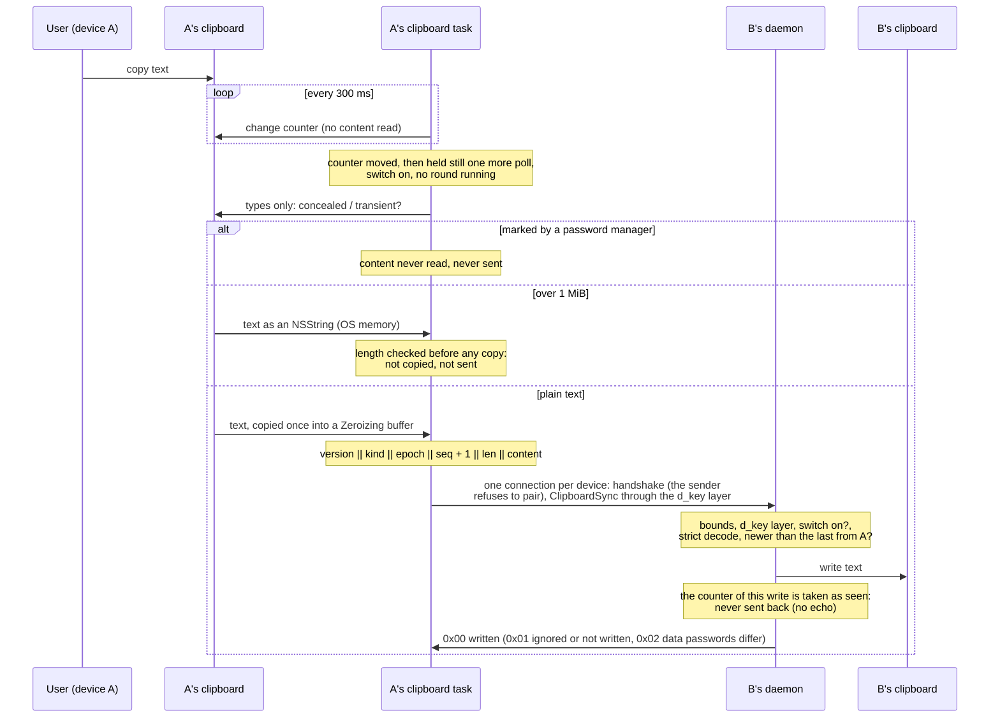
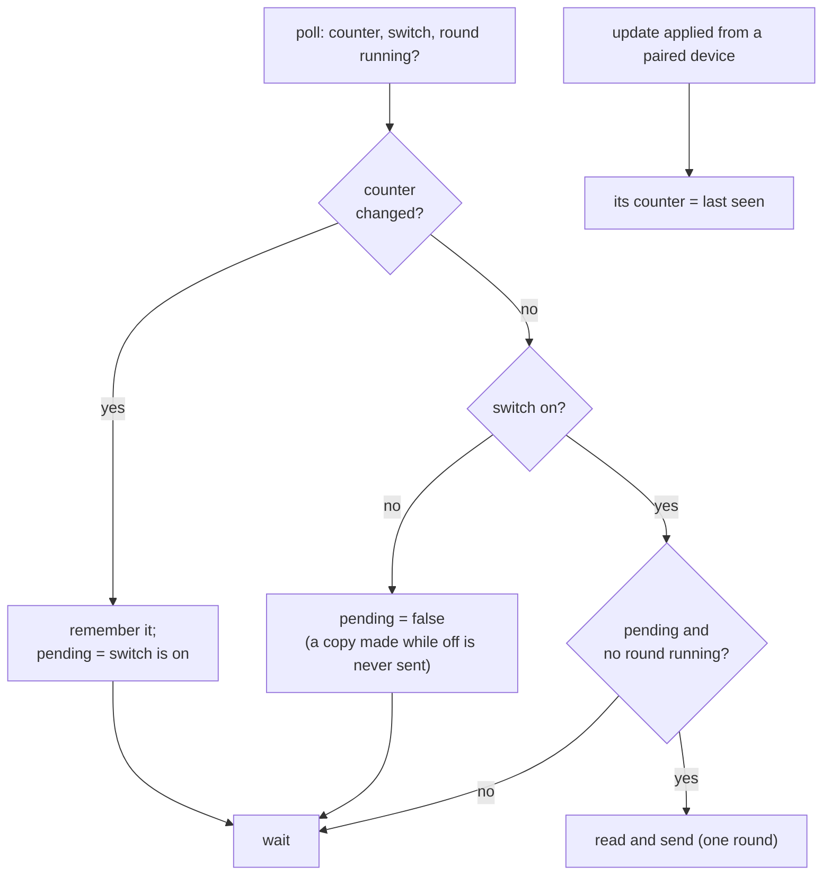
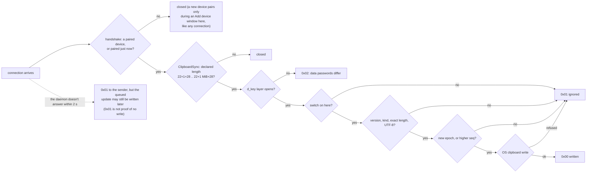

# Clipboard sync

daemon.md 12. Text only, off by default, every paired device takes part
while the switch is on.

```mermaid
sequenceDiagram
    participant U as User (device A)
    participant CB as A's clipboard
    participant A as A's clipboard task
    participant B as B's daemon
    participant CBB as B's clipboard
    U->>CB: copy text
    loop every 300 ms
        A->>CB: change counter (no content read)
    end
    Note over A: counter moved, then held still one more poll,<br/>switch on, no round running
    A->>CB: types only: concealed / transient?
    alt marked by a password manager
        Note over A: content never read, never sent
    else over 1 MiB
        CB->>A: text as an NSString (OS memory)
        Note over A: length checked before any copy:<br/>not copied, not sent
    else plain text
        CB->>A: text, copied once into a Zeroizing buffer
        Note over A: version || kind || epoch || seq + 1 || len || content
        A->>B: one connection per device: handshake (the sender<br/>refuses to pair), ClipboardSync through the d_key layer
        Note over B: bounds, d_key layer, switch on?,<br/>strict decode, newer than the last from A?
        B->>CBB: write text
        Note over B: the counter of this write is taken as seen:<br/>never sent back (no echo)
        B->>A: 0x00 written (0x01 ignored or not written, 0x02 data passwords differ)
    end
```

## When a poll sends (`ClipWatch`)

```mermaid
flowchart TB
    poll["poll: counter, switch, round running?"] --> changed{"counter<br/>changed?"}
    changed -- yes --> mark["remember it;<br/>pending = switch is on"] --> waitp["wait"]
    changed -- no --> on{"switch on?"}
    on -- no --> drop["pending = false<br/>(a copy made while off is never sent)"] --> waitp
    on -- yes --> pend{"pending and<br/>no round running?"}
    pend -- no --> waitp
    pend -- yes --> send["read and send (one round)"]
    applied["update applied from a paired device"] --> seen["its counter = last seen"]
```

## What the receiver checks

```mermaid
flowchart LR
    in["connection arrives"] --> p{"handshake: a paired device,<br/>or paired just now?"}
    p -- no --> x1["closed (a new device pairs only<br/>during an Add device window here,<br/>like any connection)"]
    p -- yes --> len{"ClipboardSync: declared length<br/>22+1+28 .. 22+1 MiB+28?"}
    len -- no --> x2["closed"]
    len -- yes --> dk{"d_key layer opens?"}
    dk -- no --> x3["0x02: data passwords differ"]
    dk -- yes --> sw{"switch on here?"}
    sw -- no --> x4["0x01 ignored"]
    sw -- yes --> fmt{"version, kind, exact length, UTF-8?"}
    fmt -- no --> x4
    fmt -- yes --> ord{"new epoch, or higher seq?"}
    ord -- no --> x4
    ord -- yes --> write{"OS clipboard write"}
    write -- ok --> ok["0x00 written"]
    write -- refused --> x4
    in -. "the daemon doesn't answer within 2 s" .-> late["0x01 to the sender, but the queued<br/>update may still be written later<br/>(0x01 is not proof of no write)"]
```
