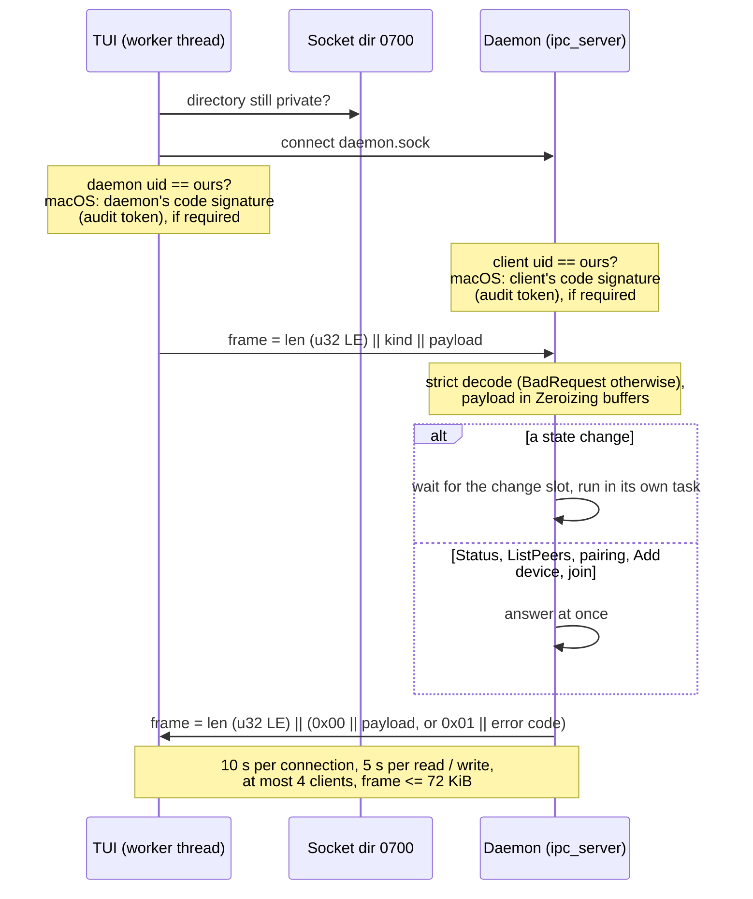
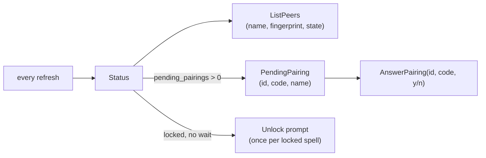

# Local IPC

daemon.md 7. One request and one response per connection; both ends check
the other before a byte goes across.

```mermaid
sequenceDiagram
    participant UI as TUI (worker thread)
    participant S as Socket dir 0700
    participant D as Daemon (ipc_server)
    UI->>S: directory still private?
    UI->>D: connect daemon.sock
    Note over UI: daemon uid == ours?<br/>macOS: daemon's code signature<br/>(audit token), if required
    Note over D: client uid == ours?<br/>macOS: client's code signature<br/>(audit token), if required
    UI->>D: frame = len (u32 LE) || kind || payload
    Note over D: strict decode (BadRequest otherwise),<br/>payload in Zeroizing buffers
    alt a state change
        D->>D: wait for the change slot, run in its own task
    else Status, ListPeers, pairing, Add device, join
        D->>D: answer at once
    end
    D->>UI: frame = len (u32 LE) || (0x00 || payload, or 0x01 || error code)
    Note over UI,D: 10 s per connection, 5 s per read / write,<br/>at most 4 clients, frame <= 72 KiB
```

## What the UI polls

```mermaid
flowchart LR
    tick["every refresh"] --> st["Status"]
    st --> peers["ListPeers<br/>(name, fingerprint, state)"]
    st -- "pending_pairings > 0" --> pp["PendingPairing<br/>(id, code, name)"]
    pp --> ans["AnswerPairing(id, code, y/n)"]
    st -- "locked, no wait" --> unlock["Unlock prompt<br/>(once per locked spell)"]
```
