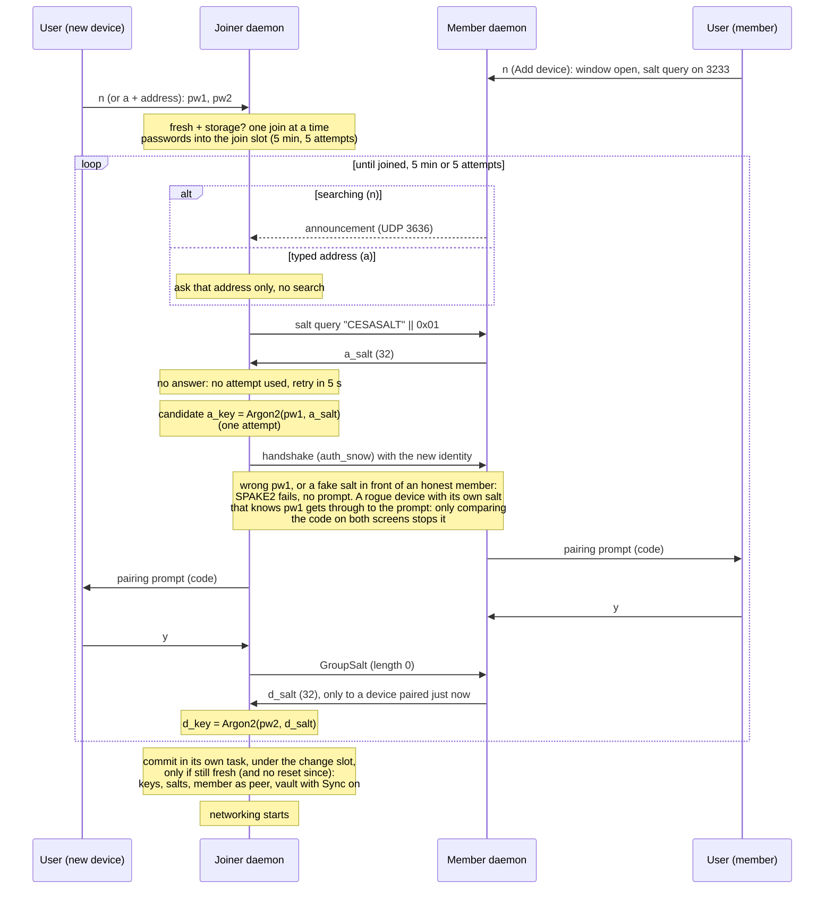
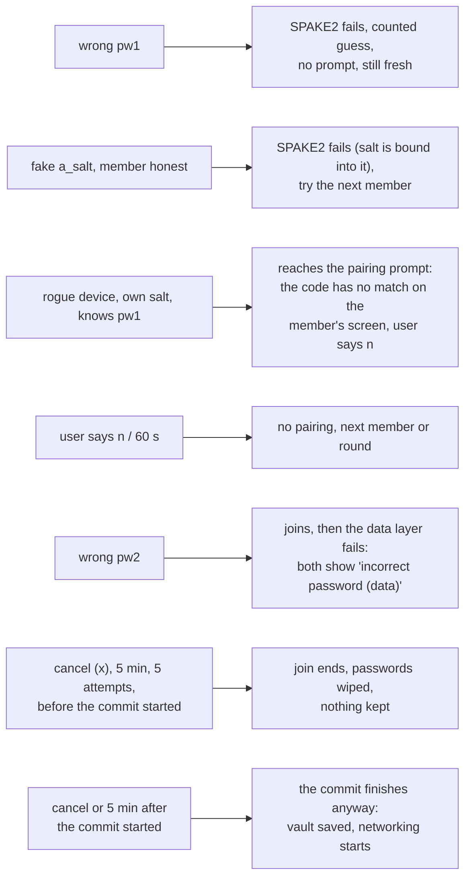

# Joining a group

daemon.md 11 and 13.2. Only a fresh device joins; the member has its
"Add device" window open.

```mermaid
sequenceDiagram
    participant UJ as User (new device)
    participant J as Joiner daemon
    participant M as Member daemon
    participant UM as User (member)
    UM->>M: n (Add device): window open, salt query on 3233
    UJ->>J: n (or a + address): pw1, pw2
    Note over J: fresh + storage? one join at a time<br/>passwords into the join slot (5 min, 5 attempts)
    loop until joined, 5 min or 5 attempts
        alt searching (n)
            M-->>J: announcement (UDP 3636)
        else typed address (a)
            Note over J: ask that address only, no search
        end
        J->>M: salt query "CESASALT" || 0x01
        M->>J: a_salt (32)
        Note over J: no answer: no attempt used, retry in 5 s
        Note over J: candidate a_key = Argon2(pw1, a_salt)<br/>(one attempt)
        J->>M: handshake (auth_snow) with the new identity
        Note over J,M: wrong pw1, or a fake salt in front of an honest member:<br/>SPAKE2 fails, no prompt. A rogue device with its own salt<br/>that knows pw1 gets through to the prompt: only comparing<br/>the code on both screens stops it
        M->>UM: pairing prompt (code)
        J->>UJ: pairing prompt (code)
        UM->>M: y
        UJ->>J: y
        J->>M: GroupSalt (length 0)
        M->>J: d_salt (32), only to a device paired just now
        Note over J: d_key = Argon2(pw2, d_salt)
    end
    Note over J: commit in its own task, under the change slot,<br/>only if still fresh (and no reset since):<br/>keys, salts, member as peer, vault with Sync on
    Note over J: networking starts
```

## What can go wrong, and what happens

```mermaid
flowchart LR
    w1["wrong pw1"] --> r1["SPAKE2 fails, counted guess,<br/>no prompt, still fresh"]
    w2["fake a_salt, member honest"] --> r2["SPAKE2 fails (salt is bound into it),<br/>try the next member"]
    w2b["rogue device, own salt, knows pw1"] --> r2b["reaches the pairing prompt:<br/>the code has no match on the<br/>member's screen, user says n"]
    w3["user says n / 60 s"] --> r3["no pairing, next member or round"]
    w4["wrong pw2"] --> r4["joins, then the data layer fails:<br/>both show 'incorrect password (data)'"]
    w5["cancel (x), 5 min, 5 attempts,<br/>before the commit started"] --> r5["join ends, passwords wiped,<br/>nothing kept"]
    w6["cancel or 5 min after<br/>the commit started"] --> r6["the commit finishes anyway:<br/>vault saved, networking starts"]
```
